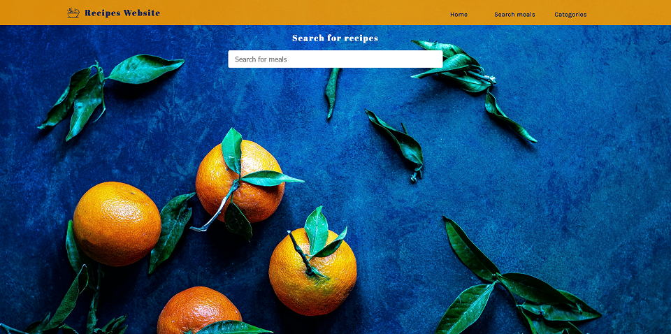

# Recipes-website

Recipes website is a simple multi-page food blog using https://www.themealdb.com/api.php free API.

## Table of contents

- [Overview](#overview)
  - [Screenshot](#screenshot)
  - [Links](#links)
- [My process](#my-process)
  - [Built with](#built-with)
  - [Continued development](#continued-development)
- [Author](#author)

## Overview

### Screenshot

### Links

- Live Site URL: [Add live site URL here](https://recipes-web-a5a10.web.app/home)

## My process

### Built with

- CSS custom properties
- CSS Grid
- Axios API, version 1.6.2
- Food Recipes API (https://www.themealdb.com/api.php)
- [Vue.js](https://cli.vuejs.org/) - JS framework, version 3.2.13
- Vue Router, version 4.2.5

### Continued development

Implamanting a hamburger icon for mobile-app view and making loading screens for all pages.

## Author

- Website - [Viktoria Lukacs](https://luktoria.github.io/Portfolio/)
